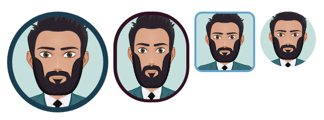

# react-rounded-image

> Convert an image into a rounded image

[](https://www.npmjs.com/package/react-rounded-image) [](https://standardjs.com)

## Install

```bash
npm install --save react-rounded-image
```

## Usage

```jsx
import React, { Component } from "react";
import ReactRoundedImage from "react-rounded-image";
import MyPhoto from "./images/me.jpg";

export default class App extends Component {
  render() {
    return (
      <div style={{ display: "flex" }}>
        <ReactRoundedImage image={MyPhoto} />
        <ReactRoundedImage
          image={MyPhoto}
          roundedColor="#321124"
          imageWidth="150"
          imageHeight="150"
          roundedSize="13"
          borderRadius="70"
        />

        <ReactRoundedImage
          image={MyPhoto}
          roundedColor="#66A5CC"
          imageWidth="120"
          imageHeight="120"
          roundedSize="8"
          borderRadius="15"
        />

        <ReactRoundedImage image={MyPhoto} roundedSize="0" imageWidth="110" imageHeight="110" />
      </div>
    );
  }
}
```

# Examples



## Adding hover color

```jsx
<ReactRoundedImage
  image={MyPhoto}
  roundedColor="#321124"
  imageWidth="150"
  imageHeight="150"
  roundedSize="13"
  hoverColor="#DD1144"
/>
```


# Properties

| Propertie    | Description                    |
| ------------ | ------------------------------ |
| image        | The image                      |
| imageWidth   | The image's width              |
| imageHeight  | The image's height             |
| roundedColor | The rounded color              |
| roundedSize  | The rounded size               |
| hoverColor   | The hover color                |
| borderRadius | The border radius(default 50%) |

## Contributors ✨

Thanks goes to these wonderful people ([emoji key](https://allcontributors.org/docs/en/emoji-key)):

<!-- ALL-CONTRIBUTORS-LIST:START - Do not remove or modify this section -->
<!-- prettier-ignore-start -->
<!-- markdownlint-disable -->
<table>
  <tr>
    <td align="center"><a href="https://github.com/AmineVolk"><br /><sub><b>HamdiAmine</b></sub></a><br /><a href="https://github.com/AmineVolk/react-rounded-image/commits?author=AmineVolk" title="Code">💻</a></td>
    <td align="center"><a href="https://github.com/vakyla98"><br /><sub><b>Dmytro Vakuliuk
</b></sub></a><br /><a href="https://github.com/AmineVolk/react-rounded-image/commits?author=vakyla98" title="Code">💻</a></td>    
  </tr>
</table>

<!-- markdownlint-enable -->
<!-- prettier-ignore-end -->

<!-- ALL-CONTRIBUTORS-LIST:END -->

This project follows the [all-contributors](https://github.com/all-contributors/all-contributors) specification. Contributions of any kind welcome!

## License

> You can check out the full license [here](https://github.com/AmineVolk/react-rounded-image/blob/master/LICENSE)

This project is licensed under the terms of the **MIT** license.
